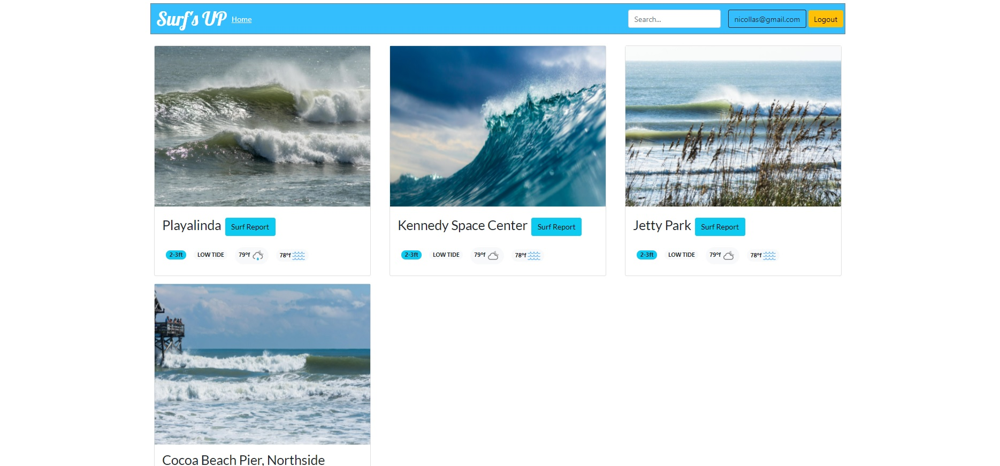
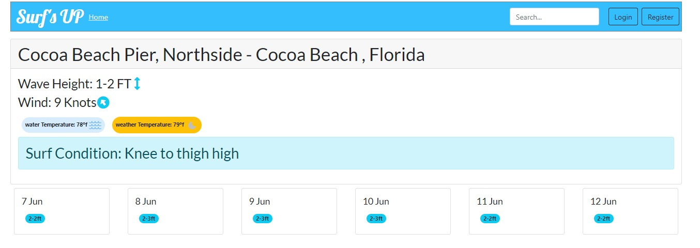

# Surf's UP - MERN Application with Authentication using JSON Web Tokens (JWT)  

## Online Example & Deployment:

https://lazysurfer.herokuapp.com/


## Description

This is a MERN application with authentication using JSON Web Tokens. This APP was design to be used by lazy surfers who doesn't wanna check their local surfing spot. the App will give you notifications of when the surf is good once you set up your favorite spot and ideal surfing conditions.

## Web Tools:

Full MERN stack: React, Node.js, Express, MongoDB, Javascript (ES6), Redux, JSON Web Tokens, Rest API, Semantic UI, BootStrap 5.0,Twlio(api to send SMS),NodeMailer,Cron (scheduler)

## Table of Contents 

* [Installation](#installation)

* [Usage](#usage)


## Installation

To install necessary dependencies, run the following command:

```
npm install
```

## Usage
``` 
    To start using this project: 

    1.  Install node modules for Fron-End and Back-End with: npm install
    2.  Create a .env file at the root location of the project to handle the database credentials and JWT secret:
    
        # Database Info
        DATABASE_INFO = "Your Mongo Credentials"

        #JWT Secret
        JWT_SECRET = "Your JWT Secret"
        #EMAIL authentication
        EMAIL_PASS="password"
        EMAIL_USER="your@gmail.com"
        #TWLIO authentication
        TWILIO_ACCOUNT_SID="your account sid"
        TWILIO_AUTH_TOKEN="your account token"

    3.  Run the following command to start the application: npm run dev
    4.  Enjoy..!
``` 

## Questions


If you have any questions about the repo, open an issue or contact [nickverneck](https://github.com/nickverneck) directly at nicollas@gmail.com.


## Screenshots





